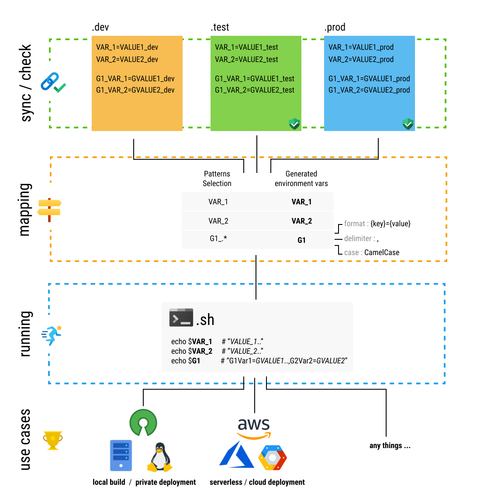

# sht / short / 🩳 
[](https://crates.io/crates/short) 
![status](https://img.shields.io/static/v1?label=status&&message=not%20stable&color=orange&logo=data:image/png;base64,iVBORw0KGgoAAAANSUhEUgAAADAAAAAwCAYAAABXAvmHAAAABmJLR0QA/wD/AP+gvaeTAAADuUlEQVRoge1ZS2gUWRQ99/VHNCOCikZGB5yFO4kfoiAoyuBoOm13dbDjb+PCz2ZWImKCuhGTncJsRBFmXESxI3aVnY6jcREFRdEYVPwQFdz5GRT8REnSXddFYlPVdHVev6omiHWgoOq+9+49p+t97q0GfPjw4WMiQU4NLW13+Pt9e2u9Y7+JhphoAm4RrHRANK39wcDfBNSAeG+XZpyvBjFZSE0h9B8s3A7EJmHol8Kwd6/ezprTt/vkSLUIjoeKp5Bplzyjdvabes/YKEBqCrV3/legHd0WPwvGZkvzagA3PeYljcoXsSmuWR+JaY1nbBTg+AaEyTFT0AkAc6x2Bq4VLZwVDd0Nky5FLg05+eLuhrmg0DGA142ZehDg/fRn1zN16mM8nRqOHFiWAQJ1BHRa7dlE+imANxbTFDEcXubkZ5R88D7AGwFMHbuakKdbnIn+6pJ/+SnU3rrk/7bW+mabkcBEuG5nSasdnVDoGIDpJVqmI0hHZYk6QekgY5Ns60CUXQeFaVMK5dqkoCYAsAlg4pVRPZ5w7l49KAnIJtKPALy1mILEdM5BxFVnT9SjEt8KtVyIwMy0z2piIFRShJlvAfCuhJf3ILQoxbdAOZnLNqVPA2i32kqJoMbuAeS4DkAKwMfRi86DaDmtv/hcNX7Bv6vRDGrUtQ4CthQ5HWHiTV2akXblXwKu8/xkKjn5a2ikF4DtLGBiFiZ6mcggpr6hmsH+K+uuDLqNVwxPCpVIKlkrQiO3AfxWplsewBMG7gqm50LQY0O74PoNeVZpRfT4QsF0A6MnrRQYSGU1fTNIfav1rCLr1oyHBGzC6C8tBQKaG3XtLzdxPa91I2mtTaCi7fErMy3NNqWfqMTzvCYWxE8rHDKZiDuSqWRYKZ7KoLJgqlMYtfhLePiQSrhqfJWQE8C4Z30kppaIEVtVabAJE8CCW0H82spFmOLfmBGT3sUAjwXE9fg8ADMluppThsM3GNgOe7Y638wHKqoRPBWQBxZJdn3R2dz5OasZl5nppK2FeEdUj2+UjempAGaSFfCgQCCU2wNgwO6IjkdSyVoZR54KIMn5T0wFAZkNmS8MbCXA+nFsZiA8/A94/HPKawGyb+C+9SGb0PtMYntqzrS+Udd2jufIMwExIzaVgd+lOgdzD4pNg9M+HCbgttVGwNHIhcSCcq48E8D5QB3kUpNPmQ2Zl8XG3jW9uRywDcBni7mGiDuWntgVcnLmOhdau3VHVYv27+g5c6ok1x/+/wFfgA8fPnz83PgG8Ekdaq6qdi0AAAAASUVORK5CYII=
)
[](https://github.com/vincent-herlemont/short/actions?query=workflow%3Alinux)
[](https://github.com/vincent-herlemont/short/actions?query=workflow%3Aosx)
[](https://discord.gg/AnVYgJM)
> A concise cli launcher / project manager using env files. 

The main goal it's readability and time saving with commands use in your project.
Short it's command-line tool that allow to run program (usually sh script) with environment variables mapping from .env files.
It is like to run `eval $(.env_file) ./script.sh` with more options. 
- It take care to **synchronize** and to **check** the format of all [**environment files**](#environment-file-environment_name) to each other.
- [**Prompt infos**](#configure-prompt) : You always known which is your current [**setup**](#setup) and  [**environment**](#environment-file-environment_name). 
- Allow multiple [**setups**](#setup) in the same [**project**](#project-shortyaml).
- Allow to store example of **no critical** environment file in your source code with a [**public env directory**](#public-directory).
- Allow to store prod/stage/etc.. and **critical** environment file in your source code with a [**private env directory 🔒**](#private-directory-).
- You can apply a mapping in order to [**select**, **group** and add **custom formats / cases**](#arrayvar) on the fly on the [environment variables](#variables).
- The result of mapping will be **inject** as [environment variables](#variables) in the output .sh script that will be executed.


variables
---

It's include an index/registry that allow to share project templates: **[🌱 template-index](https://github.com/vincent-herlemont/short-template-index/blob/master/readme.md)**.

# Install

Require for compilation : [libgit2](https://libgit2.org/), [openssl](https://www.openssl.org/).
```
cargo install short
```

### Configure prompt

It's really recommended to configure the prompt.
That allow to known every time which [**setup**](#setup) and  
[**environment**](#environment-file-environment_name) are selected. 

<details>
  <summary>✨ PS1 (BASH/ZSH)</summary>
  
Example with PS1 configure by `.bashrc`

```shell script
export PS1="$(sht show -f):\w\$ "
```

Example with PS1 configure by `.zshrc`

```shell script
⚠️ TODO ...
```

</details>

<details>
  <summary>✨ starship</summary>
  
Example with [custom pre-prompt : **starship**](https://starship.rs/advanced-config/#custom-pre-prompt-and-pre-execution-commands-in-bash).

Here the custom script that starship run before display prompt.

```shell script
#!/bin/bash

function blastoff(){
    sht show -f
}
starship_precmd_user_func=blastoff
```

Preview:
```
$> [my_setup:my_env] ~/your_project$
```
    
</details>

# Quick start with template

<details>
  <summary>🌱 Example with <b>Node && ExpressJs</b></summary>
  
  Generate a simply aws sam project base on this template [node-express](https://github.com/vincent-herlemont/node-express-short-template).
  See [`generate`](#generate-setup) for more details. 
  
  Requirement : You have installed [node](https://nodejs.org/) and [npm](https://www.npmjs.com/).
  
  ```
  $> sht init
  $> sht generate node-express -d -t
  $> sht run
  ```
  `-t`: generate from template.
  `-d`: create a sub directory _(optional)_.
</details>


<details>
  <summary>🌱 Example with <b>AWS SAM</b></summary>
  
  Generate a simply aws sam project base on this template [aws-node-sam](https://github.com/vincent-herlemont/aws-node-sam-short-template).
  See [`generate`](#generate-setup) for more details. 
  
  Requirement : You have installed [SAM](https://docs.aws.amazon.com/serverless-application-model/latest/developerguide/serverless-sam-cli-install.html)
  and [AWS_CLI](https://docs.aws.amazon.com/cli/latest/userguide/cli-chap-install.html).
  
  ```
  $> sht init
  $> sht generate aws-node-sam -d -t
  $> sht run
  ```
  `-t`: generate from template.
  `-d`: create a sub directory _(optional)_.
</details>

You can list all templates available with `sht generate -l` and add a new one [**here**](https://github.com/vincent-herlemont/short-template-index/blob/master/readme.md#add-template-and-share-with-the-community).

# Quick start blank ✍️

Generate a simply **sh** script who display variables. You can use this base
for what as you want. See [`generate`](#generate-setup) for more details. 

```
sht generate <setup_name> <environment_name> <file_kind:sh|bash>
```

```
$> sht init
$> sht generate setup_1 test sh -d
$> sht run
```
`-d`: create a sub directory (optional).

# Commands
### `init` project.
Create an empty [`short.yaml`](#configuration-file-shortyaml) configuration file. This one define the your project directory.
All `short` command inside of this folder and child's folders take for references this configuration file.
```
$> sht init
```
_[short.yaml](#configuration-file-shortyaml) (generated)_
```yaml 
setups: {}
```
### `generate` setup. 
Generate an **empty** setup or a setup from a **project templates [repository](https://github.com/vincent-herlemont/short-template-index/blob/master/readme.md)**, 
this command can be also list all available project templates.

<details>
  <summary><b>✍ Generate an empty setup ️</b></summary>

| Arguments | Required  | Description |
| ---------- | -------- | ----------- |
| <setup_name> | yes | Setup name |
| <env_name> | yes  | Env name |
| \<kind> | yes  | File kind [sh,bash ...] |

| Options | [Allow empty*](#option-allow-empty) | Default | Description |
| ---------- | -------- | ------- | ----------- |
| -d , --directory | yes | <setup_name> | Target directory. |
| -p , --private| no | false | 🔒 Save to private directory. _[conflict with "-d"]_ |
| -f , --file| no | run.sh | Path script, create directory if they miss. _[conflict with "-d"]_ |
| -e , --env-directory| no | . | Public env directory. _[conflict with "-d"]_ | 

Example : create a setup named `my_setup` with `.test` environment file and `bash` script.
```
$> sht generate my_setup test bash 
```
_short.yaml (generated)_ : Configuration file.
```
setups:
  my_setup:
    file: run.sh
    array_vars:
      all:
        pattern: ".*"
        case: CamelCase
        format: "[{key}]='{value}'"
        delimiter: " "
    vars: []
```
_.test (generated)_ : Environment file.
```
VAR1=VALUE1
VAR2=VALUE2
```
_run.sh (generated)_ : Runnable file.
```
#!/bin/bash
declare -A all && eval all=($ALL)

declare -p all
```
The seconds line `declare -A all && eval all=($ALL)` allow to use **[bash associative array](https://www.gnu.org/software/bash/manual/html_node/Arrays.html)**.

</details>

<details>
  <summary><b>🌱 List all <a href="https://github.com/vincent-herlemont/short-template-index/blob/master/readme.md">project templates</a></b></summary>
  
```
$> sht generate -l
```
</details>

<details>
  <summary><b>🌱 Generate setup from projects template</b></summary>

| Arguments | Required  | Description |
| ---------- | -------- | ----------- |
| <setup_name/template> | yes | Setup name or \<template> name with "-t" option left empty |
  
| Options | [Allow empty*](#option-allow-empty) | Default | Description |
| ---------- | -------- | ------- | ----------- |
| -t , --template | yes | <setup_name> | Template name, can be founded in list template `-l` |
| -d , --directory | yes | <setup_name> | Target directory. |
  
Example : create a setup `node-express` with its associated envs.
```
$> sht generate node-express -t
```
👉 _short.yaml (generated)_ and _run.sh (generated)_ with generate from the following project template : [**node-express**](https://github.com/vincent-herlemont/node-express-short-template).

</details>

### `rename` setup

Rename setup. e.g `my_setup` -> `another_setup`.
```
$> sht rename my_setup another_setup
```

### `new` env

Create new env. e.g `dev`
```
$> sht new dev
```
Or private env. e.g `prod`
```
$> sht new dev -p
```
🔒 `-p` save the file in the private directory. 

### `sync` env

Sync all environment and ask you for each diff what to do.
```
$> sht sync
```

### `edit` env

Edit an environment file with your default text editor. You can choose different editor with `--editor <editor>` or `EDITOR` env vars.
```
$> sht edit
```

### `dir` env directory

Set or unset env directory.
```
$> sht dir ./envs/
$> sht dir --unset
```

### `pdir` env private directory

Set or unset env directory.
```
$> sht pdir ../private_envs/
$> sht pdir --unset
```

### `use` select/switch your setup/environment

e.g. Select `my_setup` with `dev` environment.
```
$> sht use my_setup dev
```
e.g. Switch from `dev` to `prod` environment.
```
$> sht use prod
```
👉 If a setup and environment if already selected, you can avoid to provide the setup and just indicate the environment that you want.

### `show` your current setup / environment

```
$> sht show
💁 your current setup is `my_setup`:`dev`
```

### `ls` list all setups and environments

List all setups / environments and indicated the current one like `sht show`.
```
$> sht ls
  my_project (run.sh)
     prod (.prod)
     dev (.dev)
  my_sub_project_1 (my_sub_project_1/run.sh)
     prod (sub_env/.prod)
     staging (sub_env/.staging)
     test (sub_env/.test)
  my_sub_project_2 (my_sub_project_2/run.sh)
>    prod (sub_env/.prod)
     staging (sub_env/.staging)
     test (sub_env/.test)
```

### `vars` display/compare mapping environment variables

As you can see with the variables **[explanation](#variables)**. 
There is two displays environment variables (UPPER_CASE) and variables (lower_case).
```
<variable> | <ENVIRONMENT_VARIABLE> | <value>
    ..     |           ..           |   ..
```

When variable are an array this will be displayed like this.
```
<variable> | <ENVIRONMENT_VARIABLE> (<pattern>) `case`
           | <IN_ARRAY_ENVIRONMENT_VARIABLE> | <value>
           |           ..                    |    ..
```

e.g. Display variables mapping of `test` current environment
```
$> sht vars
                           | test
 all         | ALL (.*)
             | VAR1        | VALUE1
             | VAR2        | VALUE2
 var1        | VAR1        | VALUE1
 var2        | VAR2        | VALUE2
 short_setup | SHORT_SETUP | my_sub_project_2
 short_env   | SHORT_ENV   | test
```

e.g Compare variables mapping of `test` and `prod` environment
```
$> sht vars -e prod test
                           | prod             | test
 all         | ALL (.*)
             | VAR1        | VALUE1           | VALUE1
             | VAR2        | VALUE2_OF_PROD   | VALUE2
 var1        | VAR1        | VALUE1           | VALUE1
 var2        | VAR2        | VALUE2_OF_PROD   | VALUE2
 short_setup | SHORT_SETUP | my_sub_project_2 | my_sub_project_2
 short_env   | SHORT_ENV   | prod             | test
```

### `envs` display/compare environment variables

e.g. Display variables of `test` current environment
```
$> sht vars
      | test
 VAR1 | VALUE1
 VAR2 | VALUE2
```

e.g. Compare variables of `test` and `prod` environment
```
$> sht vars -e prod test
      | prod           | test
 VAR1 | VALUE1         | VALUE1
 VAR2 | VALUE2_OF_PROD | VALUE2
```

# Configuration file `short.yaml`

```yaml
setups:
  my_setup: # Setup.name : String
    file: run.sh # Setup.file : Path - Required
    public_env_dir: env/ # Setup.public_env_dir : Path - Optional
    array_vars: # Map<ArrayVar.name,ArrayVar|Regex> : Optional
      group1: ".*" # String, It's a short way to set only ArrayVar.pattern.
      group2:      # ArrayVar
        pattern: PREFIX_.*           # ArrayVar.pattern : Regex - Required
        case: CamelCase              # ArrayVar.case : Enum<Case> - Optional
        format: "[{key}]='{value}'"  # ArrayVar.format : String - Optional
        delimiter: " "               # ArrayVar.delimiter : String - Optional
    vars: []

```

#### Setup.name

Setup name

#### Setup.public_env_dir

Path towards the project subdirectory.

#### ArrayVar

This configuration allow to group and apply custom format and mapping in one environment variables.

- e.g. with the [setup configuration](#configuration-file-shortyaml)

[Environment file](#environment-file-environment_name)
```
VAR1=VALUE1
VAR2=VALUE2
PREFIX_VAR1=P_VALUE1
PREFIX_VAR2=P_VALUE2
```
Environment variable will be injected, see [ArrayVar.format](#arrayvarformat) for more details.
```
GROUP1 => VAR1:VALUE1,VAR2:VALUE2,PREFIX_VAR1:P_VALUE1,PREFIX_VAR2:P_VALUE2
GROUP2 => [PrefixVar1]='P_VALUE1' [PrefixVar2]='P_VALUE2'
```

#### ArrayVar.pattern (Regex)

All variables match with this pattern will be grouped.

For more indications see the [**lib(regex)***](https://docs.rs/regex) that it's used.

#### ArrayVar.case

Apply a case for each variables.

|   Available cases   |
| ------------------- |
|  CamelCase          |
|  snake_case         |
|  SHOUTY_SNAKE_CASE  |
|  mixedCase          |
|  Title Case         |

For more indications see the [**lib(heck)***](https://docs.rs/heck) that it's used.

#### ArrayVar.format

Format that it's apply on each variables and that will be concatenated in a string.
There is two data who can used : `{key}` and `{value}`.
- `key` it's the variables name that is specified in the [environment file](#environment-file-environment_name).
- `value` it's the variables value that is specified in the [environment file](#environment-file-environment_name).

👉 **By default (sh)** the format `{key}:{value}` it's applied.

👉 **By default (bash)** it apply a format bash associative array format `[{key}]='{value}'` [**(doc)**](https://tldp.org/LDP/Bash-Beginners-Guide/html/sect_10_02.html). 

#### ArrayVar.delimiter

A string that it's injected between each variables of the array.

👉 **By default** it's one space "` `".

#### Vars[var]

Variables as set here, are selected for injection.

👉 Must **match** with environment variables. 

👉 If it's no specified or empty, **all variables are selected**. 

# Help 
```
USAGE:
    sht [SUBCOMMAND]

FLAGS:
    -h, --help       Prints help information
    -V, --version    Prints version information

SUBCOMMANDS:
    init        Init project, create an empty "short.yaml" configuration file.
    generate    Generate empty setup or from project template repository.
    run         Run setup [ARGS...].
    rename      Rename setup.
    new         Create env file ".<env>", in public directory by default.
    sync        Sync env files.
    edit        Edit env file.
    dir         Public env directory, [.] by default.
    pdir        Private env directory, unset by default.
    use         Switch of current setup or/and environment.
    show        Show your current setup.
    ls          Display setups and environments available.
    vars        Display/Diff mapping environment variables.
    envs        Display/Diff environment variables.
    help        Prints this message or the help of the given subcommand(s)
```
---
# Concepts

### Project [`short.yaml`](#configuration-file-shortyaml)

It's a directory with the configuration file `short.yaml` inside it : that defined the **project root**.  
All `short` commands inside of this folder and his child's folders take for references this configuration file.

- For **create/init** a project see [`init`](#init-project) command.

### Setup

Setup it's is main concept of short. The setup configuration is describe in [`short.yaml`](#configuration-file-shortyaml) 
and you can add more than once. It take a **name**, a **runnable file**, [**public env directory**](#public-directory) and **mapping options**.
This is how short gets an easily way to simplify run command.

👉 Each setup one and only **one runnable file**.

- For **create/generate** a setup see [`generate`](#generate-setup)
- For **list** all setups see [`ls`](#ls-list-all-setups-and-environments) command.
- For **display** mapping of the setups see [`vars`](#vars-displaycompare-mapping-environment-variables) command.

### Directories (public/private)

These directories store [`.<env>`](#environment-file-environment_name) files.
Env files presents in this directories will be synchronised to each other.
if these set to the same [**setup**](#setup).

#### Public directory

This directory must be inside of your project (The default value it's the [root folder of the project](#project-shortyaml)).
That can be a sub folder like `./env/` see [**setup configuration**](#configuration-file-shortyaml) for more details.
So if you had configured git or another code versioning solution, public directory allow to save with your code
no critical configuration files like an example configuration file.

```
.
└── project
    ├── envs # public env directory
    │   └── .dev
    ├── ...
    └── short.yaml
```

- For **set/unset** public directory see [`dir`](#dir-env-directory) command.  

#### Private directory 🔒

This directory must be outside of your project. The path of the private directory 
will be not store in **project configuration ✅** ! So if you had configured git or
another code versioning solution that will be never commit with your code and any 
clues of your private directory will be appear to the short configuration `short.yaml`.

```
.
├── envs # private env directory
│   └── .dev
└── project
    ├── run.sh
    └── short.yaml
```

- For **set/unset** private directory see [`pdir`](#pdir-env-private-directory) command.  

### Environment file `.<environment_name>`

Each environment file define one environment in order to the environment name come from the file name like `.<my_env>` _environment file_ => `my_env` _environment name_.

👉 **The prefix `.` is mandatory**. 

The file formatting must be follow the [**RFC 2 – .env file**](https://smartmob-rfc.readthedocs.io/en/latest/2-dotenv.html) guide line.
```
# Comment

VAR1=VALUE1
VAR2=VALUE2
```

Each environment inside on the same setup (_public environment directory/private environment directory_), are **synchronised** to each other.
So value can be changed but, **variables,variables order,spaces, comments** will be the sames.

- For **create** a new environment file see [`new`](#new-env) command.
- For **list** all environment files see [`ls`](#ls-list-all-setups-and-environments) command.
- For **display** the content of environment file see [`envs`](#envs-displaycompare-environment-variables) command.
- For **edit** en environment file see [`edit`](#edit-env) command.

### Variables

Variables can be come from the [environment file](#environment-file-environment_name)
or specified in the [configuration file](#configuration-file-shortyaml) : [array_vars](#arrayvar) and [vars](#varsvar).

👉 Injected to script as an **environment variables**, variables name will be converted to **UPPER_CASE**. (See also [`vars`](#vars-displaycompare-mapping-environment-variables) command). 

👉 Represented as an variables, they always be converted to **lower_case**. (See also [`vars`](#vars-displaycompare-mapping-environment-variables) command).
This display is used only for the cli output readability, like commands as [`vars`](#vars-displaycompare-mapping-environment-variables)

### Option allow empty

Option like `-d` who can found in `sht generate my_template my_env -d` can have three state.
1) **Deactivate** you not specified the option :  e.g. `sht generate my_template my_env` 
2) **Activate**; take the value by default : e.g. `sht generate my_template my_env -d` 
The value of `-d` is `my_template`.
3) **Activate with value** : e.g.  `sht generate my_template my_env -d foo`.
The value of `-d` is `foo`.